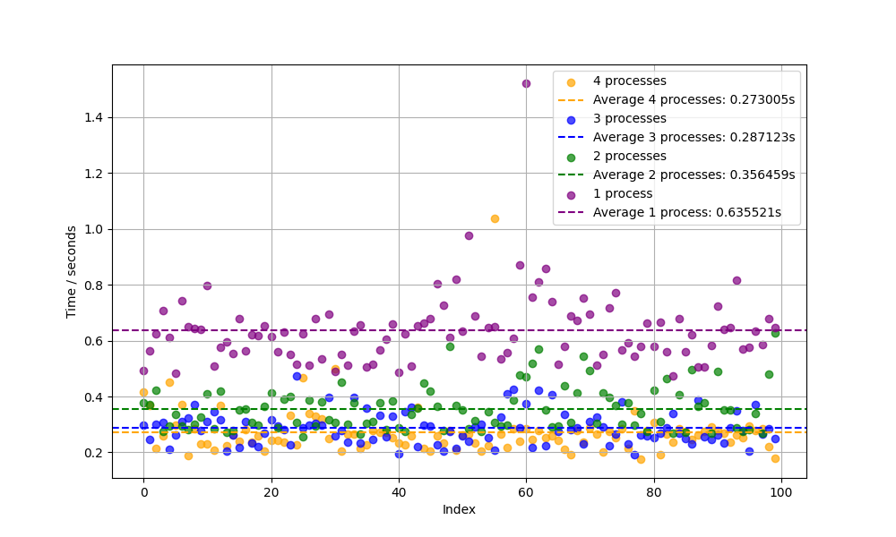

# Semestral project - Parallel PageRank algorithm

[](https://www.python.org/downloads/release/python-31012/)
[](https://conventionalcommits.org)
[-4.1.2-purple)](https://www.open-mpi.org/software/ompi/v4.1/)

## Description

This is a simple Python program that library mpi4py to multiply two matrices using parallel computing. The program is using the `mpiexec` command to run the program in parallel.

---

## Quick start

Before running the script, make sure you have Python 3.10.12 installed.
Additionally install openmpi (`apt install libopenmpi-dev`).
Also install `mpi4py` module (`pip3 install mpi4py`).

## Assignment

Implement parallel page rank algorithm using MPI. 
The algorithm should be able to work on any number of nodes
and any size of matrices.

## Implementation

My implementation has few components:

1. Function for generating adjacency matrix from the graph
2. Function to calculate the page rank

### Function for generating adjacency matrix from the graph

First I iterate through the edges and create a dictionary with the nodes as keys and the list of nodes they are connected to as values. Then I create a matrix with zeros and ones based on the edges.

### Function to calculate the page rank

I calculate the page rank using the formula:

```py
for _ in range(max_iterations):
        for v in local_nodes:
            sum_pr = np.sum(
                pagerank[row_indices[col_indices == v]]
                / out_degree[row_indices[col_indices == v]]
            )
            local_pagerank_new[v] = (
                1 - damping_factor
            ) / num_nodes + damping_factor * sum_pr
        total_pagerank_new = np.zeros(num_nodes)
        comm.Allreduce(local_pagerank_new, total_pagerank_new, op=MPI.SUM)

        pagerank = total_pagerank_new
```

I calculate the sum of the (page ranks of the nodes that are connected devided by number of incoming edges) to the current node and then update the page rank of the current node. I also multiply the page rank by the damping factor and add the (1 - damping factor) / number of nodes. I then reduce the page ranks of all nodes to the root node.
I repeat this process for the number of iterations specified.

## Results

Here are the results of the parallel page rank algorithm for different numbers of nodes:

| Number of Nodes | Time (seconds) |
|-----------------|----------------|
| 1               | 0.635521       |
| 2               | 0.356459       |
| 3               | 0.287123       |
| 4               | 0.273005       |



As you can see, the time decreases as the number of nodes increases. This is because the work is distributed among the nodes and they can work in parallel. The time is not linearly decreasing because of the overhead of communication between the nodes.
Times between the 3 and 4 nodd case are very similar sometimes the time for 3 nodes is even lower than for 4 nodes. But with big enough test cases the time for 4 nodes should be lower than for 3 nodes.
